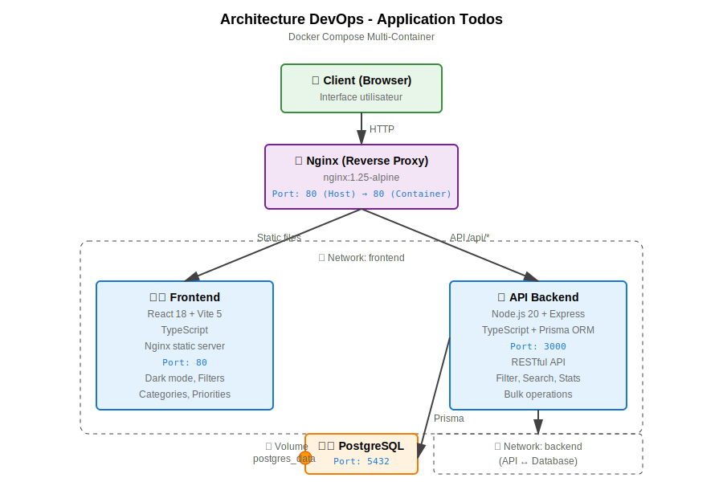

# Application Todos - Déploiement Docker

Application web complète de gestion de tâches (todos) déployable via Docker Compose sur n'importe quelle machine.

## Architecture



L'application est composée de 4 services conteneurisés orchestrés par Docker Compose :

- **Nginx (Reverse Proxy)** : Point d'entrée unique sur le port 80, route les requêtes vers Frontend (statique) et API (/api/*)
- **Frontend** : Interface React 18 + Vite avec TypeScript, servie par Nginx interne (port 80)
- **API Backend** : Node.js 20 + Express + TypeScript + Prisma ORM, expose une API RESTful (port 3000)
- **Database** : PostgreSQL 16 Alpine avec volume persistant pour les données

### Flux de communication

```
Client Browser (HTTP:80)
    ↓
Nginx Reverse Proxy
    ├─→ Frontend (Static files) → Network: frontend
    └─→ API Backend (/api/*)    → Network: frontend
            ↓
        PostgreSQL Database     → Network: backend
            ↓
        Volume: postgres_data (persistance)
```

### Réseaux Docker

- **frontend** : Communication entre Nginx ↔ Frontend ↔ API
- **backend** : Communication sécurisée entre API ↔ Database

## Prérequis

- Docker Engine 24.0+ ou Docker Desktop
- Docker Compose 2.20+
- 2 Go de RAM disponible minimum
- Ports 80 disponible (configurable)

Versions testées et recommandées :
- Docker Engine : 24.0.7
- Docker Compose : 2.23.0

## Installation et Démarrage

### Étape 1 : Configuration

Créer le fichier `.env` à partir du template fourni :

```bash
cp .env.example .env
```

Modifier les valeurs dans `.env` selon vos besoins, notamment le mot de passe PostgreSQL :

```env
POSTGRES_USER=todosuser
POSTGRES_PASSWORD=votre_mot_de_passe_securise
POSTGRES_DB=todosdb
NGINX_PORT=80
```

### Étape 2 : Démarrage

Lancer l'application avec Docker Compose :

```bash
docker compose up --build
```

Pour un démarrage en arrière-plan :

```bash
docker compose up --build -d
```

### Étape 3 : Accès

L'application est accessible à l'adresse :

```
http://localhost
```

Ou sur le port configuré dans `.env` :

```
http://localhost:NGINX_PORT
```

## Services et Ports

| Service | Port Interne | Port Exposé | Description |
|---------|-------------|-------------|-------------|
| nginx | 80 | 80 (configurable) | Point d'entrée principal |
| api | 3000 | Non exposé | API REST accessible via `/api` |
| front | 80 | Non exposé | Interface utilisateur |
| db | 5432 | Non exposé | Base de données PostgreSQL |

## Endpoints API

L'API est accessible via le reverse proxy Nginx :

- `GET /api/todos` - Liste toutes les tâches
- `POST /api/todos` - Créer une nouvelle tâche
- `PATCH /api/todos/:id` - Modifier une tâche (titre ou statut)
- `DELETE /api/todos/:id` - Supprimer une tâche
- `GET /health` - Healthcheck de l'API

## Fonctionnalités

L'interface permet de :
- Visualiser la liste des tâches
- Ajouter une nouvelle tâche
- Marquer une tâche comme terminée/non terminée
- Supprimer une tâche
- Persistance automatique des données

## Architecture Technique

### Réseaux Docker

Deux réseaux isolés pour une meilleure sécurité :

- **backend** : Communication db ↔ api
- **frontend** : Communication api ↔ front ↔ nginx

La base de données n'est accessible que par l'API, jamais exposée publiquement.

### Volumes Docker

- **postgres_data** : Persistance des données PostgreSQL

Les données survivent aux redémarrages et reconstructions des conteneurs.

### Multi-stage Builds

**API** :
- Stage 1 : Installation des dépendances et compilation TypeScript
- Stage 2 : Image de production légère avec utilisateur non-root

**Frontend** :
- Stage 1 : Build de l'application React avec Vite
- Stage 2 : Image Nginx Alpine avec les assets statiques et utilisateur non-root

Avantages : images optimisées, couches de cache efficaces, temps de build réduits.

### Healthchecks

Chaque service dispose d'un healthcheck :
- **db** : Vérification de disponibilité PostgreSQL (10s)
- **api** : Test du endpoint `/health` (15s, démarrage 40s)
- **front** : Vérification de disponibilité Nginx (30s)
- **nginx** : Test de disponibilité du serveur (30s)

Les dépendances (`depends_on`) garantissent l'ordre de démarrage correct.

### Sécurité

Mesures de sécurité implémentées :

1. **Aucun mot de passe en clair** : utilisation de variables d'environnement
2. **Utilisateurs non-root** : api et front tournent avec des utilisateurs dédiés (UID 1001)
3. **Isolation réseau** : db accessible uniquement par l'API
4. **Exposition minimale** : seul Nginx expose un port public
5. **Fichiers sensibles exclus** : `.dockerignore` pour éviter la copie de secrets

### Migrations Prisma

Les migrations sont exécutées automatiquement au démarrage de l'API via la commande :

```bash
npx prisma migrate deploy
```

Le schéma Prisma définit le modèle `Todo` avec :
- `id` : Identifiant UUID unique
- `title` : Titre de la tâche
- `done` : Statut (booléen)
- `createdAt` : Date de création automatique

## Gestion du Projet

### Arrêter l'application

```bash
docker compose down
```

### Arrêter et supprimer les volumes (reset complet)

```bash
docker compose down -v
```

### Consulter les logs

Tous les services :
```bash
docker compose logs -f
```

Un service spécifique :
```bash
docker compose logs -f api
docker compose logs -f db
docker compose logs -f front
docker compose logs -f nginx
```

### Reconstruire après modifications

```bash
docker compose up --build --force-recreate
```

## Troubleshooting

### Port 80 déjà utilisé

Modifier le port dans `.env` :
```env
NGINX_PORT=8080
```

Puis relancer :
```bash
docker compose down
docker compose up --build
```

Accès : `http://localhost:8080`

### Erreur de connexion à la base de données

Vérifier que le conteneur db est démarré et sain :
```bash
docker compose ps
docker compose logs db
```

Attendre que le healthcheck soit positif (peut prendre 30-60 secondes au premier démarrage).

### Les migrations Prisma échouent

Vérifier les logs de l'API :
```bash
docker compose logs api
```

Réinitialiser complètement la base :
```bash
docker compose down -v
docker compose up --build
```

### L'interface ne charge pas

Vérifier que tous les services sont démarrés :
```bash
docker compose ps
```

Tester l'API directement :
```bash
curl http://localhost/health
```

### Modification du code non prise en compte

Forcer la reconstruction des images :
```bash
docker compose build --no-cache
docker compose up
```

### Problème de cache Docker

Nettoyer le cache Docker :
```bash
docker builder prune -a
docker compose build --no-cache
docker compose up
```

## Développement Local (Optionnel)

Pour développer sans Docker :

### API

```bash
cd api
npm install
cp ../.env.example .env
npx prisma generate
npx prisma migrate dev
npm run dev
```

### Frontend

```bash
cd front
npm install
npm run dev
```

L'API sera accessible sur `http://localhost:3000` et le frontend sur `http://localhost:5173`.

## Choix Techniques

### Stack

- **Node.js 20 Alpine** : Version LTS, images légères
- **PostgreSQL 16 Alpine** : Base relationnelle robuste et performante
- **React 18** : Framework frontend moderne avec hooks
- **Vite 5** : Build tool rapide avec HMR
- **Express 4** : Framework web minimaliste et éprouvé
- **Prisma 5** : ORM moderne avec génération de types TypeScript
- **Nginx 1.25 Alpine** : Reverse proxy performant et léger

### TypeScript

Utilisation de TypeScript pour l'API et le frontend garantissant :
- Typage statique et détection d'erreurs à la compilation
- Meilleure maintenabilité du code
- Autocomplétion et IntelliSense

### Prisma

ORM choisi pour :
- Schéma déclaratif clair
- Migrations gérées et versionnées
- Client TypeScript généré automatiquement
- Requêtes type-safe

### Nginx comme Reverse Proxy

Avantages :
- Point d'entrée unique pour frontend et API
- Résolution des problèmes CORS
- Configuration simple du routing `/api`
- Performance optimale pour servir les assets statiques
- Load balancing possible en production

## Structure du Projet

```
epreuve-final-devops/
├── api/
│   ├── src/
│   │   ├── index.ts              # Point d'entrée de l'API
│   │   ├── prisma.ts             # Configuration client Prisma
│   │   └── routes/
│   │       └── todos.ts          # Routes CRUD todos
│   ├── prisma/
│   │   ├── schema.prisma         # Schéma de données
│   │   └── migrations/           # Migrations versionnées
│   ├── package.json
│   ├── tsconfig.json
│   ├── Dockerfile                # Multi-stage build API
│   └── .dockerignore
├── front/
│   ├── src/
│   │   ├── main.tsx              # Point d'entrée React
│   │   ├── App.tsx               # Composant principal
│   │   └── index.css             # Styles globaux
│   ├── index.html
│   ├── package.json
│   ├── vite.config.ts
│   ├── tsconfig.json
│   ├── Dockerfile                # Multi-stage build Frontend
│   ├── nginx.conf                # Config Nginx embarquée
│   └── .dockerignore
├── nginx/
│   └── nginx.conf                # Configuration reverse proxy
├── docker-compose.yml            # Orchestration des services
├── .env.example                  # Template de configuration
├── .gitignore
├── architecture.mmd              # Diagramme Mermaid
└── README.md                     # Documentation
```

## Licence

Projet éducatif - Épreuve finale DevOps
